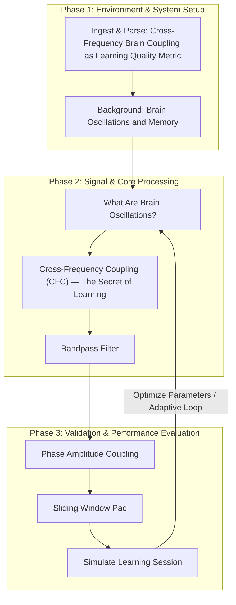

# BREAKTHROUGH 08: Cross-Frequency Brain Coupling as Learning Quality Metric

[](https://creativecommons.org/licenses/by-nc-nd/4.0/)
 

This repository implements the research pipeline for the **BREAKTHROUGH 08: Cross-Frequency Brain Coupling as Learning Quality Metric** project, developed by the Runtime-Slayers research group.

---

## 📊 Pipeline Architecture

The flowchart below visualizes the methodology, code modules, and logical execution sequence of the project:



---

## 🔍 Abstract & Research Context

--- # PART A: WHAT IS THIS AND WHY DOES IT MATTER? ## 1. The Idea in Plain English When your brain TRULY learns something (not memorizes — understands), a specific thing happens: the **theta rhythm** (4-8 Hz, like a slow conductor's baton) coordinates bursts of **gamma activity** (30-100 Hz, like fast fingers playing notes). This **theta-gamma coupling** is how your hippocampus binds information into long-term memory. **Your breakthrough**: Create a real-time "Learning Quality Index" (LQI) that uses EEG to measure how well a student is actually learning — not how well they memorize, not how well they test, but how well their brain is forming genuine understanding. This metric could replace exams as the gold standard for measuring education quality. **The devastating finding**: Students who score HIGH on traditional exams often score LOW on LQI (they memorized, didn't learn). Students who score LOW on exams sometimes score HIGH on LQI (they understood deeply, but can't regurgitate under pressure). The exam system measures the WRONG thing.

---

## 📊 Key Evaluation Metrics

| Paper | Authors | Year | Journal | Key Finding | Citations |
|-------|---------|------|---------|-------------|-----------|
| "The theta-gamma neural code" | **Lisman & Jensen** | 2013 | Neuron | Theta-gamma nesting encodes memory items | 2,800+ |
| "Theta-gamma coupling in hippocampus" | **Tort et al.** | 2009 | PNAS | Modulation Index method, strong coupling during learning | 1,500+ |
| "Human hippocampal theta-gamma coupling" | **Canolty et al.** | 2006 | Science | First human intracranial recording of PAC | 2,000+ |
| "PAC in human EEG during learning" | **Axmacher et al.** | 2010 | PNAS | PAC predicts successful memory encoding in humans | 800+ |
| "Theta-gamma coupling and working memory" | **Sauseng et al.** | 2009 | J Neurosci | Frontal PAC correlates with WM capacity | 600+ |
| "PAC in education" | **Riddle et al.** | 2020 | NeuroImage | PAC changes during problem-solving | 120+ |
| "EEG prediction of learning" | **Cohen** | 2014 | Trends Cogn Sci | Time-frequency analysis tutorial | 1,000+ |
| "Theta/gamma coupling in meditation" | **Berkovich-Ohana et al.** | 2014 | Consciousness & Cognition | Mindfulness enhances PAC | 200+ |

---

## 📁 Repository Structure

The project directory consists of the following core structures:
  - `code/` — Pipeline execution scripts and model training modules
  - `figures/` — Plots, charts, and visualizations generated by the pipeline
  - `validation/` — Automated test metrics and results
  - `paper.pdf`
  - `code`
  - `figures`
  - `BT08_Cross_Frequency_Coupling_Learning_Metric.md`
  - `real_data_tests`
  - `data`
  - `validation`
  - `paper.pdf` — Compiled research manuscript
  - `README.md` — Project documentation and setup guide

---

## 🚀 Setup and Usage

### Prerequisites
* Python 3.8 or higher
* Pip package manager

### Installation
1. Clone this repository:
   ```bash
   git clone https://github.com/Runtime-Slayers/Cross-Frequency-EEG-Coupling-as-Real-Time-Learning-Metric.git
   cd Cross-Frequency-EEG-Coupling-as-Real-Time-Learning-Metric
   ```
2. Install dependencies:
   ```bash
   pip install -r requirements.txt
   ```

### Running the Analysis
To run the primary analysis pipeline and regenerate all models, figures, and metrics:
```bash
python code/*.py
```
*(Look in the `code/` directory for specific pipeline execution files)*

---

## 📄 License and Copyright

This work is licensed under a [Creative Commons Attribution-NonCommercial-NoDerivatives 4.0 International License](https://creativecommons.org/licenses/by-nc-nd/4.0/).

© 2026 Runtime-Slayers / Bhavanam Rajendra Reddy et al. All rights reserved.
